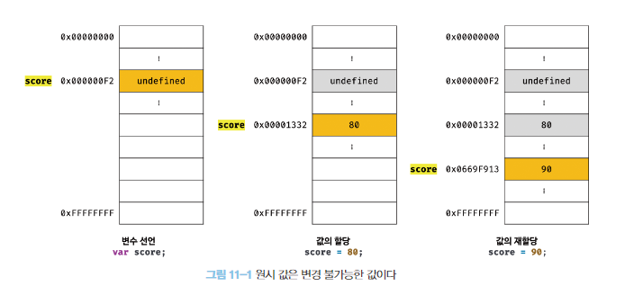
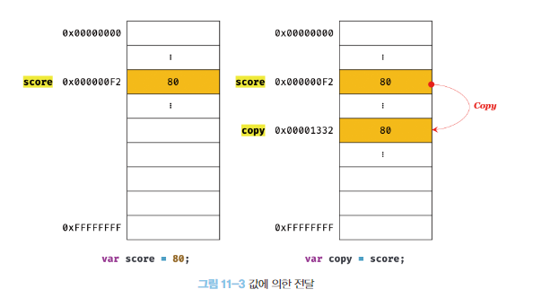
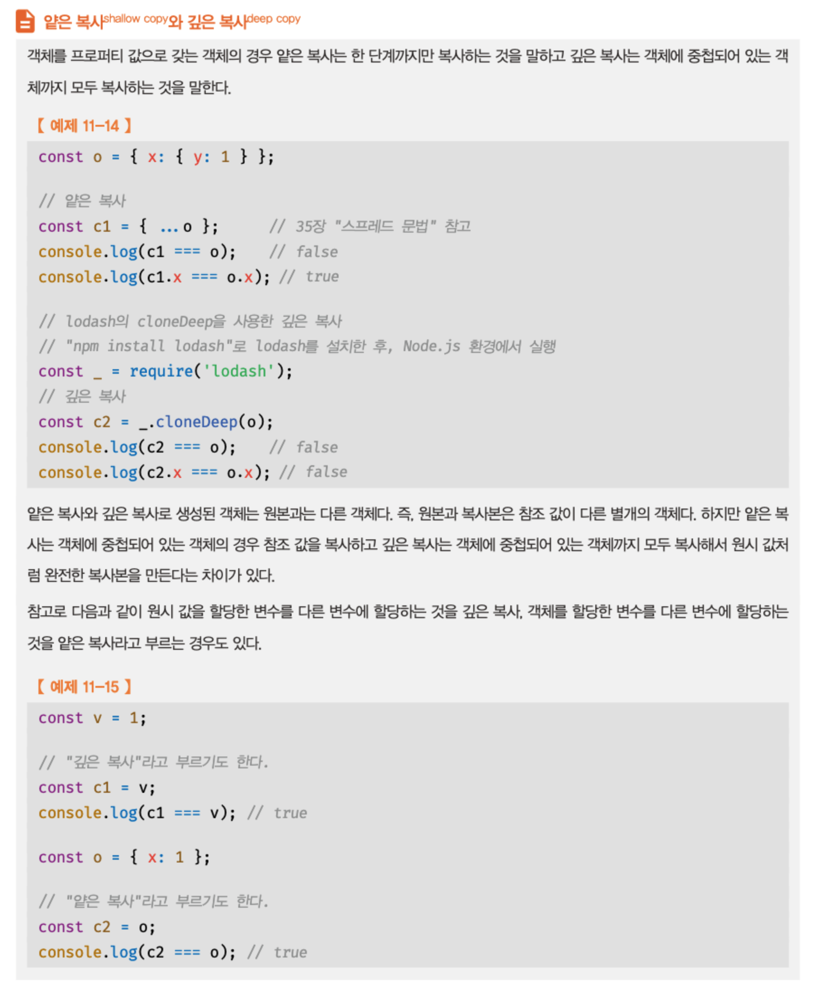

# 11. 원시 값과 객체의 비교

||원시 값|객체|
|---|---|---|
|종류|숫자, 문자열, 불리언, null, undefined, 심벌|{}, [], function(){}|
|값|변경 불가능한 값|변경 가능한 값|
|변수에 할당|변수에 실제 값 저장|변수에 참조 값 저장|
|다른 변수 할당|값에 의한 전달(원시 값이 복사되어 전달)|참조에 의한 전달(참조 값이 복사되어 전달)|


## 11-1. 원시 값 

### 11-1-1. 변경 불가능한 값
원시 값은 변경 불가능한 값으로 읽기 전용 값을 말한다.

1️⃣ 변수: 하나의 값을 저장하기 위해 확보한 메모리 공간   
2️⃣ 값: 변수에 저장된 데이터  
**변경 불가능하다는 것은 변수가 아니라 값**


✅ 만약 원시 값이 변경 가능한 값이라면?  
변수에 새로운 원시 값을 재할당했을 때   
변수가 가리키던 메모리 공간의 주소를 바꿀 필요 없이  
1️⃣ `원시 값 자체를 변경`하게 된다. 
```javascript
var score ; // 변수 선언 - 주소 0x000000F2
score = 80; // 값의 할당 - 주소 0x000000F2
score = 90; // 값 재할당 - 주소 0x000000F2
```


✅ 실제 원시 값의 메모리 참조   
변수에 새로운 원시 값을 재할당했을 때  
1️⃣ `새로운 메모리 공간을 확보`하고  
3️⃣ 재할당한 원시 값을 저장한 후  
5️⃣ 변수는 새롭게 재할당한 원시 값을 가르킨다.   

```javascript
var score ; // 변수 선언 - 주소 0x000000F2
score = 80; // 값의 할당 - 주소 0x00001332
score = 90; // 값 재할당 - 주소 0x0669F913
```


값의 이러한 특성을 불변성 이라 하며 데이터의 신뢰성을 보장한다.

### 11-1-2. 문자열과 불변성
  
문자열은 0개 이상의 문자로 이루어진 집합이며  
1개의 문자는 2바이트의 메모리 공간에 저장된다.

✅ 자바스크립트는 원시 타입인 `문자열 타입`을 제공   
- 문자열은 유사 배열 객체이면서 이터러블이므로 배열과 유사하게 접근 가능하다.
- 1️⃣ 인덱스로 프로퍼티 값에 접근할 수 있고 
- 2️⃣ length 프로퍼티를 갖을 수 있다.
```javascript
var str = 'string';

// 유사배열
// 1️⃣ index로 접근
str[0]; // s

// 2️⃣ length
srt.length; //  6
```

✅ 생성된 문자열의 일부 문자를 변경하면?
- 원시타입이므로 변경 불가능 
- 1️⃣ 즉, 문자열이 생성된 이후에는 변경할 수 없음
- 어떤 일이 있어도 불변하므로 데이터의 신뢰성을 보장한다.
```javascript
var str = 'string';
// 1️⃣ 변경 불가능
str[0] = 'A';
str[0]; // s
```


✅ `변수에 새로운 문자열을 재할당` 하는것은?  
기존에 문자열을 변경하는 것이 아니라  
새로운 문자열을 새롭게 할당하는 것이기 때문에 `가능`하다.
```javascript
var str = 'Hello';
str = 'World';

str; // World
```


>💡  
> 문자열은 원시타입으로 변경이 불가능  
> 그러나 재할당은 가능하다!


📒🚥🌟

### 11-1-3. 값에 의한 전달

✅ 변수에 변수를 할당하면?  
  변수에 원시 값을 갖는 변수를 할당하면  
  - 할당받는 변수(copy)에는 할당되는 변수(score)의 1️⃣`원시 값이 복사되어 전달` 된다. (`값에 의한 전달`)

```javascript
var score = 80;

// 1️⃣ 값에 의한 전달
// score 변수의 값 80이 복사되어 전달
var copy = score; 
score; // 80
copy; // 80 
score === copy; // true
```



✅ score와 copy의 메모리 공간은?
- 값에 의한 전달은 (변수에는 값이 전달되는 것이 아니라) `메모리 주소가 전달되는 것`
- 이 때 두 변수의 원시 값은 서로 다른 메모리 공간을 차지한다. 
- 즉, score 변수와 copy 변수의 값은 `다른 메모리 공간에 저장된 별개의 값`이라는 것
- 2️⃣ score 변수의 값을 변경해도 copy 변수의 값에는 어떠한 영향도 주지 않는다.
```javascript

// 2️⃣
score = 100;
score; // 100
copy; // 80
score === copy; // false
```


값에 의한 참조에서 변수를 할당하는 시점에 대한 고찰

변수에 원시 값을 갖는 변수를 할당하는 시점에는 
- 원시 값이 복사되어 새로운 메모리에 저장 할수도 있고
- 두 변수가 같은 원시 값을 참조하다가 어느 한쪽의 변수에 재할당이 이루어졌을 때 새로운 메모리 공간에 재할당된 값을 저장하도록 동작할 수도 있다. (파이썬 동작 참고)


ECMAScript 사양에 명확하게 정의도어 있지 않고 제조사에 따라 동작 방식의 차이가 있을 수 있다.

## 11-2. 객체

✅ 객체는 확보해야할 메모리 공간의 크기를 사전에 정해 둘 수 없다.
- 프로퍼티의 개수가 정해져 있지 않고
- 동적으로 추가 삭제가 가능
- 프로퍼티 값에 제약이 없다.

✅ 자바스크립트 객체 관리 방식  - 잘 모르겠다


### 11-2-1. 변경 가능한 값
객체(참조) 타입의 값, 즉 객체는 변경 가능한 값이다.

✅ 객체는 메모리에 어떻게 접근하나
- 1️⃣ 변수 메모리에는 객체가 저장되어있는 메모리 주소(참조 값)를 저장하여 가리킨다
- 2️⃣ 가리키고 있는 주소를 통해 실제 객체에 접근
- 참조 값은 생성된 객체가 저장된 메모리 공간의 주소이다.

```javascript
var person = { //1️⃣ 0x000000F2 에 0x00001332(주소) 저장
  name: 'Lee' // 2️⃣ 0x00001332 에 객체 저장
}
```


✅ 객체는 변경 가능한 값
재할당 없이 객체를 직접 변경 할 수 있다.  
재할당하지 않으므로 객체를 할당한 변수의 참조 값은 변경되지 않는다.
- 1️⃣ 프로퍼티 동적 추가
- 2️⃣ 프로퍼티 값 갱신
- 프로퍼티 삭제 
```javascript
var person = {
  name: 'Lee'
}

// 1️⃣
person.address = 'Seoul';

// 2️⃣
person.name = 'Kim';

person; // {name: "Kim", address: "Seoul"}
```


✅ 객체가 재할당 하지 않는 이유  
객체는 크기가 일정하지 않으므로(크기가 매우 클수도 있으므로) 복사해서 생성하는 비용이 많이 든다.  
즉, 메모리의 효율적 소비가 어렵고 성능이 나빠진다. 
따라서 객체는 변경 가능한 값으로 설계되어 있다.  
이러한 설계 때문에 여러 개의 식별자가 하나의 객체를 공유할 수 있다.

✅ 깊은 복사와 얕은 복사



객체를 프로퍼티 값으로 갖는 객체의 경우
- 얕은 복사는 한 단계 까지만 복사하는 것
- 깉은 복사는 객체에 중첩되어 있는 개체까지 모두 복사하는 것

```javascript

// 1️⃣ 깊은 복사
const v = 1;
const c1 = v;
c1 === v; //true


// 2️⃣ 얕은 복사
const o = {
  x:1
}
const c2 = o;
c2 === 0; //true
```

### 11-2-2. 참조에 의한 전달
```javascript
var person = {
  name: 'Lee'
}

// 얕은 복사 - 참조 값을 복사 
// 참조에 의한 전달 : 원본에 다른 변수를 할당하면 원본의 참조 값이 복사되어 전달된다
var copy = person;
```


원본 person과 사본 copy는 저장된 메모리 주소는 다르지만 동일한 참조 값을 갖는다.  
두 개의 식별자가 하나의 객체를 공유한다. 즉, 서로 영향을 주고받는다.

```javascript
var person = {
  name: 'Lee'
}

var copy = person; // 얕은복사 - 참조 값을 복사. 동일한 참조 값을 갖는다
copy === person ; // true - 동일한 객체 참조

// person을 통해 객체 변경
person.address = "Seoul"

// copy를 통해 객체 변경
copy.name= "Kim"

// 원본과 복사본이 서로 영향을 받는다
person;  // {name: "Kim", address: "Seoul"}
copy;    // {name: "Kim", address: "Seoul"}
```

