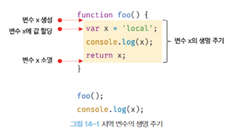

# CH14.전역 변수의 문제점

## 14-1. 변수의 생명 주기

### 14-1-1. 지역 변수의 생명 주기

함수 내부에서 선언된 지역 변수는 함수가 생성되고 함수가 종료하면 소멸한다.  
변수의 생명 주기는 메모리 공간이 확보된 시점부터 메모리 공간이 해제되어 가용 메모리 풀에 반환되는 시점까지다.
할당된 메모리 공간은 더 이상 그 누구도 참조하지 않을 때 가비지 콜렉터에 의해 해제되어 가용 메모리 풀에 반환된다.
```javascript
function foo(){
    var x = 'local';
    console.log(x);
    return x;
}

foo();
console.log(x);
```


호이스팅은 스코프 단위로 동작한다. 지역 변수의 호이스팅은 지역 변수의 선언이 지역 스코프의 선두로 끌어 올려진 것처럼 동작한다.

### 14-1-2. 전역 변수의 생명 주기
전역 코드는 명시적인 호출 없이 실행된다. 전역 코드에는 반환문을 사용할 수 없으므로 마지막 문이 실행되어 더 이상 실행할 문이 없을 때 종류한다.  
var 키워드로 선언한 전역 변수의 생명 주기는 전역 객체의 생명 주기와 일치한다.

## 14-2. 전역 변수의 문제점
**암묵적 결함**
전역 변수를 선언한 의도는 전역, 즉 코드 어디서든 참조하고 할당할 수 있는 변수를 사용하겠다는 것이다. 이는 모든 코드가 전역 변수를 참조하고 변경할 수 있는 암묵적 결합을 허용한는 것이다. 변수의 유효 범위가 크면 클수록 코드의 가독성은 나빠지고 의도치 않게 상태가 변경될 수 있는 위험성도 높아진다.

**긴 생명 주기**  
전역 변수는 생명 주기가 길다. 변수 이름이 중복되면 의도치 않은 재할당이 이뤄진다.

**스코프 체인 상에서 종점에 존재**  
전역 변수는 스코프 체인 상에서 종점에 존재한다. 이는 변수를 검색할 때 전역 변수가 가장 마지막에 검색된다는 것을 말한다. 즉, 전역 변수의 검색 속도가 가장 느리다.

**네임스페이스 오염**
파일이 분리되어 있다 해도 하나의 전역 스코프를 공유한다는 것이다.

### 14-3-1. 즉시 실행 함수
모든 코드를 즉시 실행 함수로 감싸면 모든 변수는 즉시 실행 함수의 지역 변수가 된다.
```javascript
(function(){
    var foo = 10; // 즉시 실행 함수의 지역 변수
}())

console.log(foo) // ReferenceError : foo is not defined
```

### 14-3-2. 네임스페이스 객체
전역에 네임스페이스 역할을 담당할 객체를 생성하고 전역 변수처럼 사용하고 싶은 변수를 프로퍼티로 추가하는 방법이다.

```javascript
var MYAPP = {}; //전역 네임스페이스 객체
MYAPP.name = 'Lee';
console.log(MYAPP.name); //Lee
```

네임스페이스 객체에 또 다른 네임스페이스 객체를 프로퍼티로 추가해서 네임스페이스를 계층적으로 구성할 수도 있다.
```javascript
var MYAPP = {};
MYAPP.person = {
    name: 'Lee',
    address: 'Seoul'
}
console.log(MYAPP.person.name); //Lee
```

### 14-3-3. 모듈 패턴
모튤 패턴은 클래스를 모방해서 관련이 있는 변수와 함수를 모아 즉시 실행 함수로 감싸 하나의 모듈을 만든다.  
자바스크립트는 public, private, protected 등의 접근 제한자를 제공하지 않는다. 모듈 패턴은 전역 네임스페이스의 오염을 막는 기능은 물론 한정적이기는 하지만 정보 은닉을 구현하기 위해 사용한다.
```javascript
var Counter = (function(){
    var num = 0;

    return{
        increase(){
            return ++num;
        },
        decrease(){
            return --num;
        }
    }
}())

console.log(Counter.num); // undefined
console.log(Counter.increase()); //1
console.log(Counter.increase()); //2
console.log(Counter.decrease()); //1
console.log(Counter.decrease()); //0
```

### 14-3-4. ES6모듈
ES6 모듈은 파일 자체의 독자적인 모듈 스코프를 제공한다. var 키워드로 선언한 변수는 더는 전역 변수가 아니며 window 객체의 프로퍼티도 아니다. 