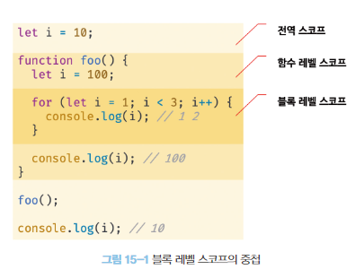
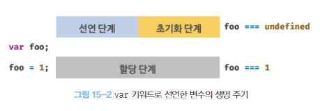
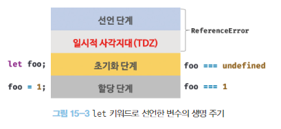

# CH15. let, const 키워드와 블록 레벨 스코프

## 15-1. var 키워드로 선언한 변수의 문제점

### 15-1-1. 변수 중복 선언 허용
var 키워드로 선언한 변수를 중복 선언하면 초기화문 유무에 따라 다르게 동작한다.   
초기화문이 있는 변수 선언문은 자바스크립트 엔진에 의해 var 키워드가 없는 것처럼 동작하고 초기화문이 없는 변수 선언문은 무시된다.

### 15-1-2. 함수 레벨 스코프
var 키워드로 선언한 변수는 오로지 함수의 코드 블록만을 지역 스코프로 인정한다. 따라서 함수 외부에서 var 키워드로 선언한 변수는 코드 블록 내에서 선언해도 모두 전역 변수가 된다.

### 15-1-3. 변수 호이스팅
var 키워드로 변수를 선언하면 변수 호이스팅에 의해 변수 선언문이 스코프의 선두로 끌어 올려진 것처럼 동작한다. 즉, 변수 호이스팅에 의해 var 키워드로 선언한 변수는 변수 선언문 이전에 참조할 수 있다.

## 15-2. let 키워드
var 키워드의 단점을 보완하기 위해 ES6 에서는 새로운 변수 키워드인 let, const를 도입했다.

### 15-2-1. 변수 중복 선언 금지
let 키워드로 이름이 같은 변수를 중복 선언하면 문법 에러가 발생한다.

### 15-2-2. 블록 레벨 스코프
let 키워드로 선언한 변수는 모든 코드 블록(함수, if, for 문, while 문, try/catch 문 등)을 지역 스코프로 인정하는 블록 레벨 스코프를 따른다.

### 15-2-3. 변수 호이스팅
let 키워드로 선언한 변수는 변수 호이스팅이 발생하지 않는 것처럼 동작한다.  
let 키워드로 선언한 변수는 "선언 단계"와 "초기화 단계"가 분리되어 진행된다.
스코프의 시작 지점부터 초기화 시작 지점까지 변수를 참조할 수 없는 구간을 일시적 사각지대 라고 부른다.

### 15-2-4. 전역 객체와 let
var 키워드는 전역 객체의 프로퍼티를 참조할 때 window를 생략할 수 있다.  
let 키워드로 선언한 전역 변수는 전역 객체의 프로퍼티가 아니다. 

### 15-3. const 키워드
const 키워드는 상수를 선언하기 위해 사용한다. 하지만 반드시 상수만을 위해 사용하지는 않는다.

### 15-3-1. 선언과 초기화
const 키워드로 선언한 변수는 반드시 선언과 동시에 초기화해야 한다.  
const 키워드로 선언한 변수는 let 키워드로 선언한 변수와 마찬가지로 블록 레벨 스코프를 가지며, 변수 호이스팅이 발생하지 않는 것처럼 동작한다.

### 15-3-2. 재할당 금지
var 또는 let 키워드로 선언한 변수는 재할당이 자유로우나 const 키워드로 선언한 변수는 재할당이 금지된다.

### 15-3-3. 상수
cost 키워드로 선언하 변수에 원시 값을 할당한 경우 변수 값을 변경할 수 없다. 변수의 상대 개념인 상수는 재할당이 금지된 변수를 말한다.  
일반적으로 상수의 이름은 대문자로 선언해 상수임을 명확히 나타낸다. 여러 단어로 이뤄진 경우에는 언더스코어(_)로 구분해서 스네이크 케이스로 표현하는 것이 일반적이다.

### 15-3-4. const 키워드와 객체
const 키워드로 선언된 변수에 객체를 할당한 경우 값을 변경할 수 있다. const 키워드는 재할당을 금지할 뿐 "불변"을 의미하지는 않는다. 새로운 값을 재할당하는 것은 불가능하지만 프로퍼티 동적 생성, 삭제, 프로퍼티 값의 변경을 통해 객체를 변경하는 것은 가능하다.

## 15-4. var vs let vs const
변수 선언에는 기본적으로 const를 사용하고 let은 재할당이 필요한 경우에 한정해 사용하는 것이 좋다. const 키워드를 사용하면 의도치 않은 재할당을 방지하기 때문에 좀 더 안전하다.
변경이 발생하지 않고 일기 전용으로 사용하는 원시 값과 객체에는 const 키워드를 사용한다.
