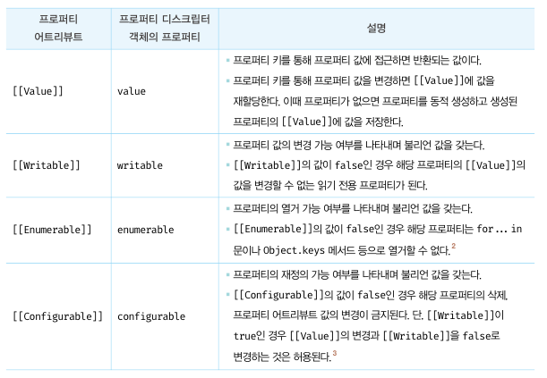
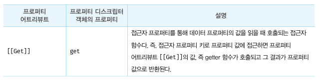
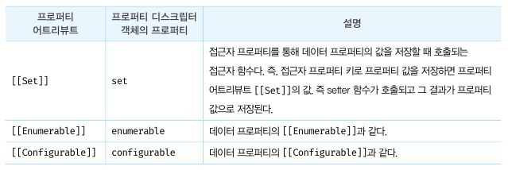

# CH16. 프로퍼티 어트리뷰트
## 16-1. 내부 슬롯과 내부 메서드
내부 슬롯과 내부 메서드는 자바스크립트 엔진의 구현 알고리즘을 설명하기 위해 ECMAScript 사양에서 사용하는 의사 프로퍼티와 의사 메서드다.

## 16-2. 프로퍼티 어트리뷰트와 프로퍼티 디스크립터 객체
자바스크립트 엔진은 프로퍼티를 생성할 때 프로퍼티의 상태를 나타내는 프로퍼티 어트리뷰트를 기본값으로 자동 정의한다.  
프로퍼티의 상태란 프로퍼티의 값, 값의 갱신 가능 여부, 열거 가능 여부, 재정의 가능 여부를 말한다.

## 16-3. 데이터 프로퍼티와 접근자 프로퍼티
- 데이터 프로퍼티: 키와 값으로 구성된 일반적인 프로퍼티다. 지금까지 살펴본 모든 프로퍼티는 데이터 프로퍼티다.  
- 접근자 프로퍼티: 자체적으로는 값을 갖지 않고 다른 데이터 프로퍼티의 값을 읽거나 저장할 때 호출되는 접근자 함수로 구성된 프로퍼티다.

|객체의 프로퍼티|	프로퍼티 어트리뷰트|
|:---|:---|
|데이터 프로퍼티|	Value, Writable, Enumerable, Configurable|
|접근자 프로퍼티|	Get, Set, Enumerable, Configurable|

## 16-3-1. 데이터 프로퍼티
데이터 프로퍼티는 다음과 같은 프로퍼티 어트리뷰트를 갖는다. 이 프로퍼티 어트리뷰트는 자바스크립트 엔진이 프로퍼티를 생성할 때 기본값으로 자동 정의된다.

## 16-3-2. 접근자 프로퍼티
접근자 프로퍼티는 자체적으로는 값을 갖지 않고 다른 데이터 프로퍼티의 값을 읽거나 저장할 때 사용하는 접근자 함수로 구성된 프로퍼티이다.

## 16-4. 프로퍼티 정의