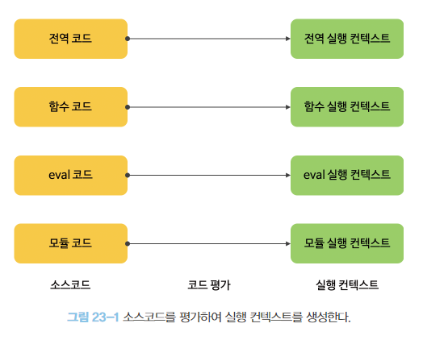
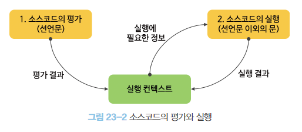

# CH23. 실행 컨텍스트

실행 컨텍스트란?  
자바스크립트의 동작 원리를 담고 있는 핵심 개념으로,  
실행할 코드에 제공할 환경 정보들을 모아놓은 객체

즉, 자바스크립트 코드가 실행되는 환경이다.  
모든 자바스크립트 코드는 실행 컨텍스트 내부에서 실행된다고 생각하면 된다.

## 소스코드의 타입

소스코드의 타입에 따라 실행 컨텍스트를 생성하는 과정과 관리 내용이 다르기 때문에  
ECMAScript 사양은 소스코드를 4가지 타입으로 구분한다.

1. 전역코드
2. 함수코드
3. eval 코드
4. 모듈 코드



## 소스코드의 평가와 실행

자바스크립트 엔진은 소스코드의 평가와 소스코드의 실행 과정으로 나누어 처리한다.



## 실행 컨텍스트의 종류

1. 전역 실행 컨텍스트
2. 함수 실행 컨텍스트
3. eval 실행 컨텍스트
4. 모듈 실행 컨텍스트

-   코드가 실행이 시잘될 때 전역 컨텍스트가 생성되며,  
    함수가 호출될 때마다 함수 컨텍스트가 생성된다.
-   컨텍스트 생성 시 컨텍스트 안에  
    변수객체(arguments, variable), scope chain, this 가 생성된다.
-   컨텍스트 생성 후 함수가 실행되는데, 사용되는 변수는 변수객체 안에서 값을 찾고 없으면 스코프 체인을 따라 올라가며 찾는다.
-   함수실행이 마무리되면 해당 컨텍스트는 사라지고(클로저 제외) 페이지가 종료되면 전역 컨텍스트가 사라진다.

```javascript
var name = "zero"; // 1️⃣변수선언 6️⃣변수대입
function wow(word) {
    // 2️⃣변수선언 3️⃣변수대입
    console.log(word + "" + name); // ⏸️
}
function say() {
    // 4️⃣변수선언 5️⃣변수대입
    var name = "nero"; // 8️⃣
    console.log(name); // 9️⃣
    wow("hello"); // 🔟
}
say(); // 7️⃣
```

1. 전역 컨텍스트
   전역 컨텍스트가 생성된 후 변수객체(arguments, variable), 스코프체인, this 가 들어온다.  
   전역 컨텍스트는 arguments(함수의 인자)가 없고, variable은 해당 스코프의 변수들 - 1️⃣name, 2️⃣wow, 4️⃣say 이다.

    scope chain(자신과 상위 스코프들의 변수객체)은 자기 자신인 전역 변수객체 이다.
    this는 따로 설정되어 있지 않으면 window 이다.

    이를 객체 형식으로 표현하면,

    ```javascript
    '전역 컨텍스트' : {
       '변수객체': {
          arguments: null,
          variable: ['name', 'wow', 'say'],
       },
       scopeChain: ['전역 변수객체']
    }
    ```

    코드를 위에서부터 실행하는데, wow랑 say는 호이스팅 때문에 선언과 동시에 대입이 된다. 그 후 variable의 name에 'zero'가 대입된다.

2. 함수 컨텍스트
   `7️⃣ say();`를 하는 순간 새로운 컨텍스트인 say 함수 컨텍스트가 생긴다.  
   전역 컨텍스트는 그대로고, arguments는 없고, variable은 name.  
   scope chain은 say 변수객체와 상위의 전역 변수객체이다.

    ```javascript
       'say 컨텍스트' : {
          변수객체 : {
             arguments: null,
             variable: ['name'], // 초기화 후 [{name: 'nero'}]가 된다.
          },
          scopeChani: ['say 변수객체', '전역 변수객체'],
          this: window,
       }
    ```

    `7️⃣ say();` 호출한 뒤 8️⃣,9️⃣,🔟 실행.

    ```javascript
    function say() {
        var name = "nero"; // 8️⃣
        console.log(name); // 9️⃣
        wow("hello"); // 🔟
    }
    ```

    8️⃣ variable의 name에 nero를 대입해주고  
     9️⃣ `console.log(name);` 에서 name 변수는 say 컨텍스트안에서 찾고 콘솔에 찍힌다.  
     🔟 `wow('hello')` 는 say 컨텍스트 안에서 변수 wow를 찾을 수 없으므로  
     scope chain을 따라 올라가 상위변수객체인 전역변수객체에서 찾는다.  
     전역변수객체의 variable에 wow라는 함수를 호출하게된다.

    `wow()`함수가 호출되었으니 wow 컨텍스트가 생기고,  
     arguments는 word='hello', scope chain은 wow 스코프와 전역스코프 이다.  
     ❓여기서 중요한게 lexical scoping에 따라 wow 함수의 스코프 체인은 선언 시에 이미 정해져 있습니다. 따라서 say 스포크는 wow 컨텍스트의 scope chain이 아니다.

    ```javascript
       'wow 컨텍스트': {
          변수객체: {
             arguments: [{word: 'hello'}],
             variable: null,
          },
          scopeChain: ['wow 변수객체','전역 변수객체'],
          this: window,
       }
    ```

    컨텍스트가 생성되고 함수가 실행된다.

    ```javascript
    function wow(word) {
        // 2️⃣변수선언 3️⃣변수대입
        console.log(word + "" + name); // ⏸️
    }
    ```

    word랑 name 변수는 wow 컨텍스트 찾으면 된다.
    word는 arguments에서 찾을 수 있고,  
     name은 wow 변수객체에는 값이 없으나 scope chain을 따라 전역스코프에서 찾을 수 있다.  
     전역변수객체로 올라가보면 variable에 `{name: 'zero'}` 가 있다.(nero가 아님)  
     wow 컨텍스트에 따르면 wow 함수는 애초에 say 건텍스트와 일절 관련이 없다.

    이제 wow 함수 종료 후 wow 컨텍스트가 사라지고 say 함수의 실행이 마무리 되면서 say 컨텍스트도 사라진다. 그리고 마지막 남은 전역 컨텍스트도 사라진다.

https://www.zerocho.com/category/JavaScript/post/5741d96d094da4986bc950a0

https://junilhwang.github.io/TIL/Javascript/Domain/Execution-Context/  
https://velog.io/@edie_ko/js-execution-context  
https://east-star.tistory.com/14
